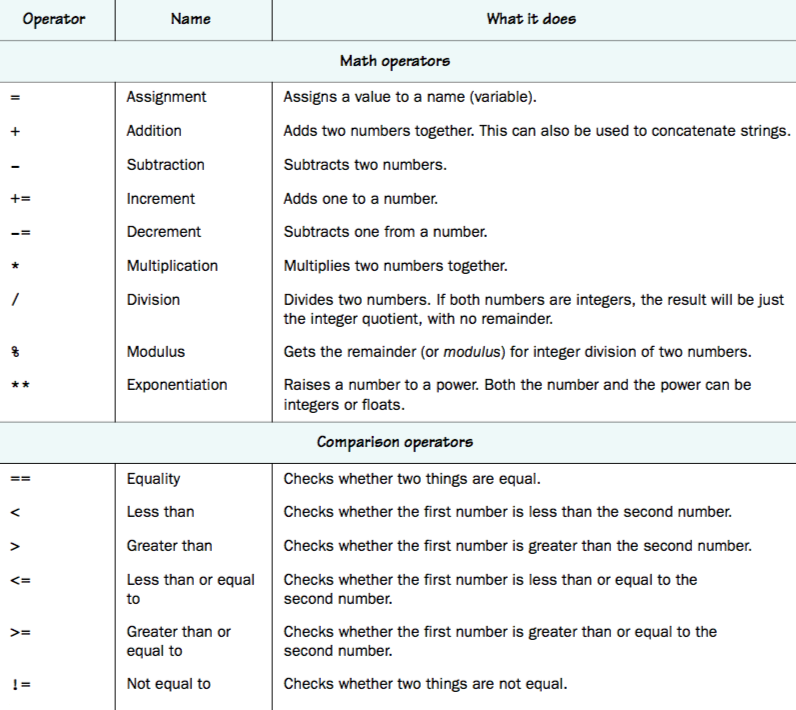

# Exercise 0: Lesson

## Things you will need to know:

### How to `print` text to the user:

The `print(*value)` function.
```py
print("Hello")                  # Hello
print(42)                       # 42
print("I am", 17, 'years old.') # I am 17 years old.
```

### How to get user `input`:

The `input(prompt)` function.
```py
input() == 'blah'
# > blah
input('Who are you:') == 'Noah Cardoza'
# > Who are you:Noah Cardoza
input('In what year were you born? ') == '2000'
# > In what year were you born? 2000
```
**NOTE**: `input` always returns a `Str`, if we want a `Int` or `Float`:
```py
int(input('In what year were you born? ')) == 2000
# > In what year were you born? 2000
```

### Variable Assignment:

```py
print('What! Who are you?')
name = input('What is your name? :: ')
# > What is your name? :: Noah
age = int(input('How old are you? :: '))
# > How old are you? :: 17
willBe42In = 42 - age
print ('Nice to meet you', name + '.', 'Guess what, you will be 42 in', willBe42In, 'years!')
```

### `if`, `elif`, and `else`:

Where $-\infty < n < \infty$:

```py
if n > 10:
  print ('n is greater than 10')
elif n < 0:
  print ('n is less than 0')
else:
  print ('n inclusively between 0 and 10')
```

### Math and comparison operators:

  
